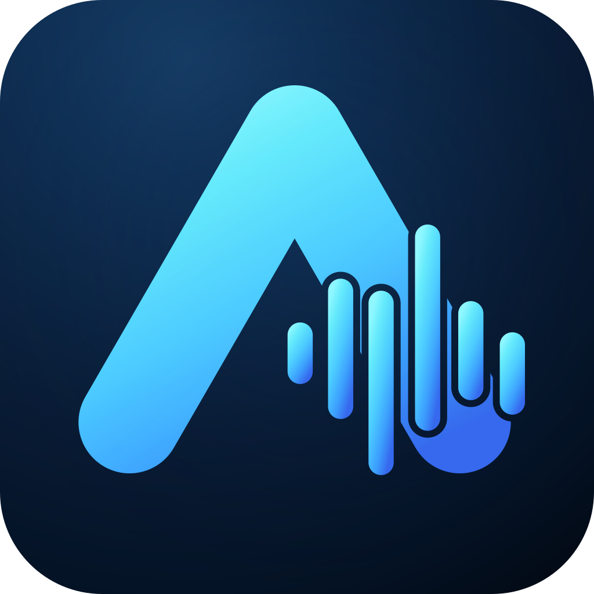
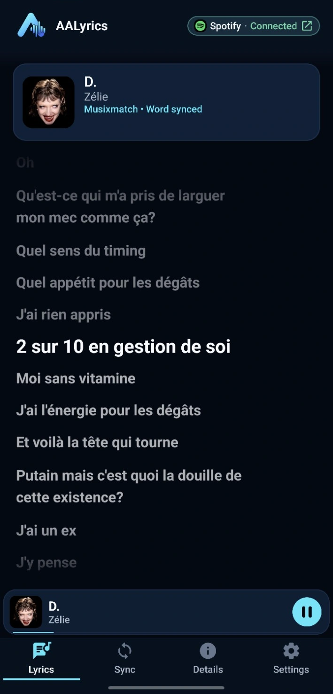
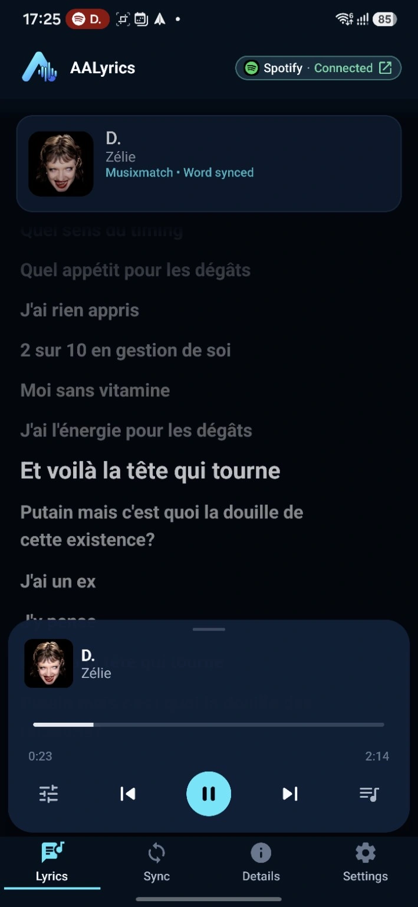
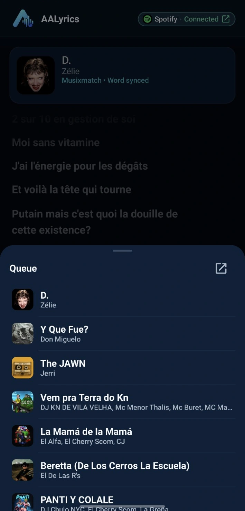
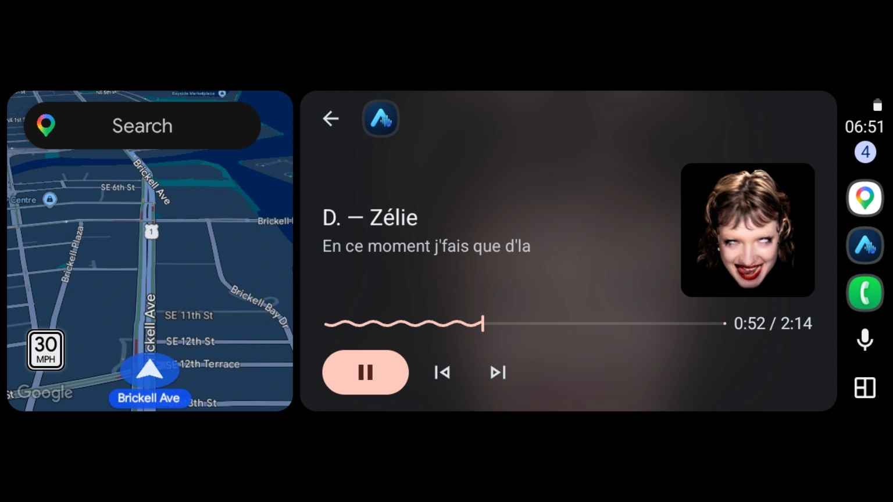
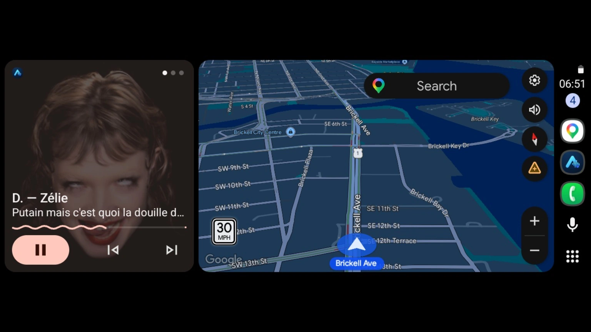

<p align="center">
  
</p>

<h1 align="center">AALyrics</h1>

<p align="center">
  <strong>Synchronized lyrics for Android and Android Auto.</strong>
</p>

<p align="center">
  Follow the song that is playing with real-time lyrics on your phone and in Android Auto.
</p>

<p align="center">
  <a href="https://www.android.com/"></a>
  <a href="CHANGELOG.md"></a>
  <a href="LICENSE"></a>
</p>

<p align="center">
  <a href="https://github.com/whoxamxl/AALyrics/releases"></a>
</p>

<div align="center">
  
</div>

AALyrics observes the active Android media session, matches the current track against multiple lyrics providers, and presents the best available lyrics in real time. The core experience is already functional on Phone and Android Auto, with on-device Translation, experimental word-synced Karaoke, playback controls, and signed in-app updates built around it.

## ✨ Highlights

- 🎵 **Synchronized lyrics** — plain, line-synced, and genuine word-synced lyrics when the selected provider supplies them.
- 🚘 **Android Auto Now Playing** — current lyric line, artwork, translated line when eligible, and the transport controls exposed by the active media app.
- 🔎 **Multiple lyrics providers** — LRCLIB, PetitLyrics, Musixmatch, and SyncLRC with provider-independent candidate selection.
- 🌍 **On-device Translation** — translated lyrics remain tied to the canonical lyric document and playback timing.
- 🎤 **Experimental WORD_SYNC Karaoke** — opt-in Phone presentation for genuine word-timed lyrics.
- 🎛️ **Phone playback surface** — play/pause, previous/next, seek, relative seek, and Queue support where the active media app exposes them.
- 🔄 **Built-in updates** — signed GitHub Release APK discovery, SHA-256 verification, package/signing preflight, and Android PackageInstaller handoff.

### Phone experience

<div align="center">
  
  
</div>

### Android Auto experience

AALyrics brings the same active lyric context into Android Auto Now Playing, and remains usable in split view alongside navigation.

<div align="center">
  
</div>

<p align="center"><sub>Now Playing with the active synchronized lyric, artwork, seek state, and available transport controls.</sub></p>

<div align="center">
  
</div>

<p align="center"><sub>AALyrics in Android Auto split view alongside navigation.</sub></p>

## Get AALyrics

AALyrics is distributed outside Google Play as a **signed APK through GitHub Releases**.

**[Open GitHub Releases →](https://github.com/whoxamxl/AALyrics/releases)**

1. Download the current signed `AALyrics-vX.Y.Z[-channel.N].apk`.
2. Install the APK. Android may ask you to allow the browser or file manager to install unknown apps.
3. Open AALyrics.
4. Enable **Notification access** for AALyrics. This is required so AALyrics can identify and follow the active Android media session.

Each Release also includes a matching `.sha256` file for APK integrity verification.

After the first release-signed installation, later AALyrics releases signed with the same key can update the installed app normally. AALyrics can also discover, verify, and hand off newer releases through its in-app update flow.

> [!NOTE]
> If a debug build is already installed, uninstall it before installing the first signed Release APK. Debug and Release builds use different signing identities.

## Android Auto

AALyrics currently uses the sideloaded Android Auto media compatibility path and focuses on a clean **Now Playing** lyrics experience.

To enable it:

1. Install and open AALyrics on the phone and enable Notification access.
2. Enable **Android Auto developer mode**.
3. Open Android Auto **Developer settings** and enable **Unknown sources**.
4. Reconnect Android Auto if needed.
5. Make sure AALyrics is enabled in the Android Auto launcher/customize list.

The host receives the active track, artwork, supported playback actions, current synchronized lyric line, and an eligible translated line when available. Android Auto controls the final layout and text truncation.

## AALyrics 1.0 Beta

AALyrics has moved beyond the construction-only stage. Its primary purpose — following lyrics for the track currently playing — is functional on Phone and Android Auto.

The **1.0 Beta** line means the intended product identity and core experience are established, while some advanced functionality is still evolving:

- Sync calibration controls and persistence are still in development.
- Phone WORD_SYNC Karaoke remains experimental and opt-in.
- Android Auto is currently line-oriented Now Playing rather than full Phone feature parity or Karaoke presentation.

These are Beta limitations, not a claim that the app is feature-complete or ready for a stable `1.0.0` release.

## Lyrics, Translation & Karaoke

AALyrics can consume plain, line-synchronized, and genuine word-synchronized lyrics depending on what the selected provider returns.

Phone lyrics automatically follow playback while still allowing manual browsing. Shared timing semantics keep Phone and Android Auto aligned to the same canonical lyric document. Genuine word-synchronized data can additionally drive the experimental Phone Karaoke presentation.

Translation uses the established AALyrics Translation pipeline and on-device language models where supported. Translated text is secondary presentation only: it remains tied to the identity and timing of the canonical lyrics.

Actual lyric availability and timing quality depend on the metadata exposed by the active media app and on matching lyric data available from the providers.

## Development

AALyrics is an Android project built with Gradle. For a local debug installation:

```bash
./gradlew :app:installDebug
```

CI uses JDK 17. Local/CI debug APKs are development artifacts and are not interchangeable with the signed GitHub Release channel.

<details>
<summary><strong>Project structure & developer documentation</strong></summary>

```text
app                    Android application / composition root
core:model             Shared domain models
core:lyrics            Lyrics lifecycle and orchestration
core:timing            Shared synchronized-lyrics timing semantics
provider:api           Provider contracts
provider:matching      Provider-neutral matching semantics
provider:lrc           Shared LRC parsing
provider:selection     Cross-provider candidate selection
provider:lrclib        LRCLIB integration
provider:petitlyrics   PetitLyrics integration
provider:musixmatch    Musixmatch integration
provider:synclrc       SyncLRC integration
platform:media         Android media-session / playback integration
ui:designsystem        Shared UI tokens and components
ui:phone               Phone presentation
ui:automotive          Android Auto presentation
```

Start with:

- [Architecture](docs/ARCHITECTURE.md)
- [Lyrics pipeline](docs/LYRICS_PIPELINE_ARCHITECTURE.md)
- [Timing architecture](docs/TIMING_ARCHITECTURE.md)
- [Translation architecture](docs/TRANSLATION_ARCHITECTURE.md)
- [Android Auto Now Playing](docs/ANDROID_AUTO_NOW_PLAYING.md)
- [Branding](docs/BRANDING.md)
- [Release policy](docs/RELEASES.md)
- [Roadmap](docs/ROADMAP.md)

Package: `io.github.whoxamxl.aalyrics`

</details>

## License

AALyrics is **source-available**, not Open Source Initiative (OSI) open source.

The project is licensed under the **PolyForm Noncommercial License 1.0.0**. Personal and other noncommercial uses are permitted under its terms. Commercial use requires separate permission from the copyright holder.

See [LICENSE](LICENSE) for the complete terms.
